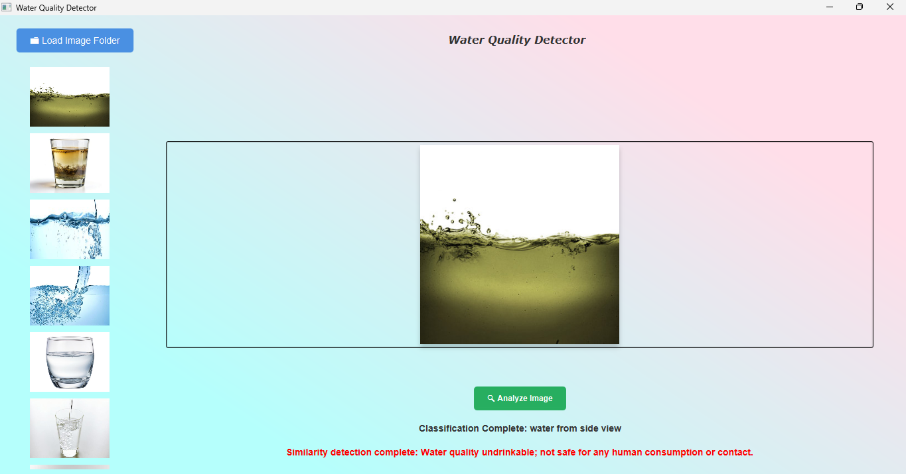
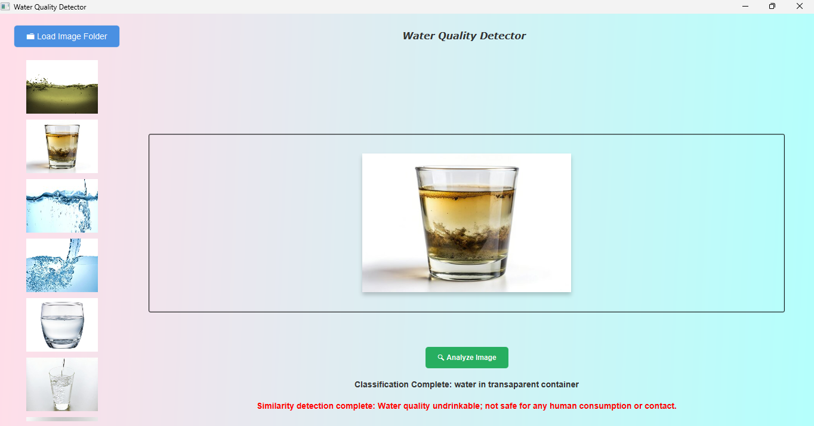
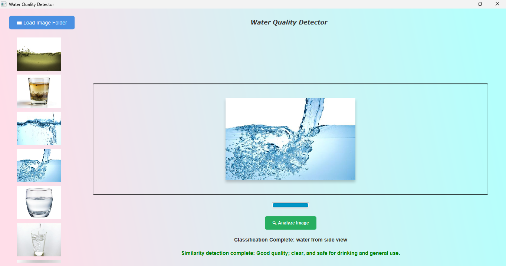

<div style="text-align: center;">
    
</div>

# Table of Contents
- [Table of Contents](#table-of-contents)
- [Algorithms](#algorithms)
- [Features](#features)
- [Problem Statement](#problem-statement)
- [Solution](#solution)
- [Justification](#justification)
- [introduction](#introduction)
- [Graph Construction](#graph-construction)
  - [Adjacency Map](#adjacency-map)
    - [Hashing Function](#hashing-function)
    - [Probing](#probing)
- [Image to Graph Construction](#image-to-graph-construction)
  - [Smart Edge Pruning](#smart-edge-pruning)
  - [Adaptive Super Pixels](#adaptive-super-pixels)
- [Graphical User Interface](#graphical-user-interface)
    - [Graph Edit Distance (GED)](#graph-edit-distance-ged)
  - [Progress bar and Task](#progress-bar-and-task)
- [Core Functions](#core-functions)
  - [Graph Edit Distance](#graph-edit-distance)
    - [Smart Cost Functions](#smart-cost-functions)
  - [Minimum Spanning Tree](#minimum-spanning-tree)
    - [MST Distance](#mst-distance)
    - [MST Quick Reject](#mst-quick-reject)
    - [Precomputed MST](#precomputed-mst)
  - [K Nearest Neighbour](#k-nearest-neighbour)
- [Classification and Similarity](#classification-and-similarity)
  - [Classification](#classification)
  - [Similarity](#similarity)
    - [Weighted votes](#weighted-votes)
    - [Alpha based Similarity Detection](#alpha-based-similarity-detection)
- [Conclusion](#conclusion)
- [How to Compile and Run the Program](#how-to-compile-and-run-the-program)
- [Results](#results)
- [References](#references)
  - [Data Structures and Algorithms](#data-structures-and-algorithms)
  - [Robin Hood Hashing](#robin-hood-hashing)
  - [Graph Edit Distance](#graph-edit-distance-1)
  - [MST Features](#mst-features)
  - [MST Pre-filter](#mst-pre-filter)

# Algorithms
- Graph construction using nodes and edges to represent important features.
- Graph Edit Distance (GED) to measure how many node/edge additions/deletions are needed to match two graphs.
- k-Nearest Neighbours (k-NN) Graph Matching
- Minimum Spanning Tree (MST) Comparison to calculate the MST for each image using Prim’s/Kruskal’s algorithm.

# Features
- [Smart Edge pruning](#smart-edge-pruning)
- [Adaptive super pixels](#adaptive-super-pixels)
- [Accurate progress bar](#progress-bar-and-task)
- [Robin hood probing](#probing)
- [Alpha based similarity detection](#alpha-based-similarity-detection)

# Problem Statement
Millions of people are forced to rely on unsafe water sources such as streams, rivers and
unprotected wells. According to South African Human Rights Commission over 50% of rural
households lack access to a reliable water supply. Water quality needs to be assessed and the
Current methods are problematic: Inconsistent observations due to manual examination, Slow
processing times for test results and Limited ability to examine polluted spread. 

# Solution
A Java-based desktop application for automated water quality detection.
Features include:
- Implementing a classification algorithm to classify water samples in categories (e.g.
undrinkable, contaminate, dirty)
- Using similarity detection technique to differentiate water samples and pick out trends in water
contamination

# Justification
The project introduces a new method for water quality detection using graph-based techniques.
it is a good idea to use graphs because it allows for better classification of water samples, and
also addresses challenges in traditional testing methods by being faster and more accurate
similarity detection.


# introduction
Within the confines of the project given to us, the language being used is Java, which is well-suited for the object-oriented approach we need to adopt. 
We would describe the outline of what is expected as follows:
  - Creating the Graph Abstract Data Type (ADT) along with its underlying ADTs—a map and a linked positional list.
  - Constructing the mechanisms to encapsulate both an image and its corresponding graph representation within a single structure, this will be accompanied by supplementary attributes and operations such as image to graph conversion.
  - The GUI serves the purpose of visualizing the graph and the various functions our application will provide
  - The auxiliary algorithms associated with similarity detection and classification, such as MST, GED, and KNN.
  - Implementing the core operations that leverage the above algorithms (MST, GED, KNN) to carry out classification and similarity detection.
  - Concluding the workflow by interpreting the classification and similarity detection outcomes to deliver a meaningful analysis regarding the state and quality of the water.
  - Introducing an innovative approach to monitor and track the lengthy process of image analysis.
Below we discuss these topics in details.

# Graph Construction
The graph we used is an adjacency map graph, which maintains a list of vertices, where each vertex stores a secondary data structure—an adjacency map. In this map, the adjacent vertex serves as the key, and the corresponding edge between them is the value. We adopted this graph structure because it enables more efficient access to a specific edge (u, v), with expected O(1) time complexity when using hashing. This graph representation is well-discussed in the textbook referenced [here](#data-structures-and-algorithms).

## Adjacency Map
The map ADT needed to be implemented efficiently for the purposes of the graph, where each vertex typically has a small number of incident vertices. Parts of our implementation are also credited to the approach documented in [this source](#data-structures-and-algorithms). For this reason, we chose to implement a hash map with several improvements to optimize performance. First, we use a low load factor, since adjacency maps are small and resizing will not be expensive; this also helps avoid clustering. Second, we employ high-quality hash functions such as MurmurHash or multiply-shift hashing, which work particularly well for coordinate data. Third, we utilize Robin Hood probing to reduce the worst-case performance of hashing. Given that our water analysis may involve dynamic updates, efficient lookups are crucial. Therefore, we use a lower load factor (around 0.5), resizing when the map is half full, as this approach works well with linear probing and further helps prevent clustering in small adjacency maps.

### Hashing Function 
We use this hashing approach because pixels exhibit spatial patterns that simple hash functions tend to amplify. The use of two prime number multipliers helps break up these grid-like patterns effectively, while XOR shifting provides the final mixing step to ensure a more uniform distribution of hash values.

### Probing
Our probing and hashing algorithm uses [Robin Hood Hashing](#robin-hood-hashing), which is based on one simple rule: during insertion, if the current key's probe distance (how far it has travelled from its original hashed bucket) is greater than the probe distance of the existing key in that slot, the two keys are swapped, and the insertion process continues. 
The detailed steps are as follows:
  1. Each entry tracks its probe distance—the number of steps it has moved from its initial bucket.
  2. When inserting a new entry, probing starts from the position given by its hash.
  3. At each step, the probe distance of the current entry is compared with that of the existing entry in the slot.
  4. If the current entry’s probe distance is greater, the entries are swapped, and probing continues with the displaced entry.
This method helps equalize probe distances among all keys, pushing keys that originally had long probe sequences forward while allowing those far from their ideal buckets to move closer. Essentially, when a new key has travelled farther than an existing key at a position, it takes that position and forces the displaced key to keep probing.
Robin Hood hashing is particularly well-suited for dynamic graphs as it provides more consistent performance, especially with small hash tables. 
However, it comes with some drawbacks:
  - Slightly higher overhead per operation.
  - Increased implementation complexity.
  - Still requires a good hash function and an appropriate load factor for optimal performance.

# Image to Graph Construction
Now that we have created an efficient graph ADT for representing an image, we turn our attention to the construction of the graph from the image.
A graph is a complex structure, especially when used to represent an image. For an accurate and meaningful representation, each pixel must be converted into a vertex, with edges representing the relationships or weights between pixels. Since an image can contain tens of thousands of pixels, the first challenge is finding an efficient way to convert the image into a graph. The following techniques are focused on achieving that.

## Smart Edge Pruning
As an attempt to reduce the complexity of the graph we introduced common way to reduce the number of edges the graphs has, however with a little kick. 
Edge pruning for graphs is a technique used to simplify the graph or improve its performance by selectively creating edges only when the colour difference between nodes is below a predefined threshold. 
This approach helps reduce unnecessary complexity while maintaining essential properties such as connectivity and the preservation of important structures within the graph. 
Pruning can be performed either during the graph construction phase or after the graph has been built. 
A key part of this method involves tracking the edges that are pruned—both in terms of their count and total weight. These values are used to compute an average, which is then employed to influence the weighting of future edges that are not pruned. 
This adaptive strategy ensures that the pruning process contributes not just to simplification, but also to a more informed and balanced weighting scheme that reflects the overall structure and similarity patterns within the graph.

## Adaptive Super Pixels
Reducing edges is great, however with an image with tens of thousands of pixels the real overhead is introduced by the subsequent vertices mapping to each pixels.
Introducing super pixels during graph construction was a necessary compromise to address this critical performance issue. 
Specifically, we encountered a heap overflow error when processing high-quality images, as the increased pixel count translated to a significantly larger number of vertices in the graph. 
To manage this, we implemented a super pixel approach that reduces the number of vertices without severely compromising the image’s structural integrity. 
This involves defining a region size such that each region, comprising multiple pixels, is represented by a single vertex in the graph. While this inevitably leads to some loss in detail, we mitigate the degradation in quality by dynamically adjusting the region size based on the image resolution. 
For high-resolution images, a larger region size is used to reduce vertex count efficiently, whereas for lower-resolution images, the region size remains small—even maintaining a 1:1 ratio where feasible. This strategy ensures that the accuracy of the graph representation is preserved where it matters most, as high-resolution images are less sensitive to minor detail loss, while low-resolution images retain their clarity through finer granularity.


# Graphical User Interface
Our GUI was built using JavaFX, leveraging its rich set of GUI components to create a responsive and user-friendly application. It features smooth hover effects, keyframe animations, and a styled scrollbar to enhance the user experience. The interface is streamlined, allowing users to interact with just two buttons — one for selecting folders to generate thumbnail images, and another to start the analysis process, simplifying overall usage. Providing feedback to the user is crucial since the underlying algorithms are computationally intensive such as:
* **Prim’s Algorithm (using Fibonacci heap):**
  $O(E + V \log V)$ — better asymptotic complexity, but more complex implementation.

### Graph Edit Distance (GED)
* Computing **exact** GED between two graphs with $n$ and $m$ vertices respectively is **NP-complete**.
* Exact computation complexity is generally **exponential**, often expressed as:
  $$
  O\left( (n + m)! \right)
  $$
So to ensure users remain informed during processing we adopted a cleaver way to monitor progress of these algorithms that are being computed across multiple graphs.

## Progress bar and Task
To ensure a smooth user experience, we designed the image analysis process to run on a separate thread by utilizing JavaFX’s **Task** class. This approach prevents the UI from freezing during computationally heavy operations and allows us to provide real-time progress updates through the **updateProgress** method. These progress updates are then monitored and visually reflected by a JavaFX **ProgressBar**, giving users clear feedback on the operation’s status.

However, implementing progress reporting was more complex due to the multi-class architecture involved in the analysis. Initially, we tried passing the entire **Task** instance down the call hierarchy so that lower-level classes could invoke **updateProgress** directly. Unfortunately, **updateProgress** is a protected method within the **Task** class, which means it isn’t accessible outside of its own class or subclasses.

To solve this, we adopted a cleaner and more flexible approach by passing the **updateProgress** method itself as a parameter, rather than the entire **Task**. We achieved this by using Java’s **BiConsumer** functional interface, which matches the signature of **updateProgress**—accepting two parameters (current progress and total work) and returning nothing. This way, lower-level components can simply invoke the passed-in method reference to report progress without needing direct access to the **Task**.

This design choice reduces coupling between the analysis logic and the GUI threading code, keeping our implementation modular and clean. It allows the core analysis classes to remain focused on their functionality without being burdened by unrelated UI concerns. Meanwhile, the progress updates flow naturally back to the **Task** running on its own thread, ensuring smooth communication between the backend processing and the frontend user interface.

This approach is interesting because, from a strict Object-Oriented Programming (OOP) perspective, it somewhat breaks traditional visibility and encapsulation principles by externally passing a protected method (**updateProgress**) as a functional interface into other classes. In Java, a language known for its strong emphasis on OOP and access control, methods like **updateProgress** are typically hidden from outside access to preserve encapsulation. Yet, by treating this method as an instance variable (via a **BiConsumer**), we essentially expose internal behavior in a controlled way, allowing classes like our KNN analyzer to invoke it without violating the class’s intended boundaries too severely. Despite being an old-fashioned workaround, I found it fascinating that Java’s flexible functional interface system enables this pattern, blending functional programming styles with OOP to achieve clean, decoupled code.


# Core Functions
Now comes the challenging part: developing the algorithms that will form the backbone for classification and similarity detection. We will use Graph Edit Distance (GED) to quantify how dissimilar two graphs are by measuring the cost of transforming one graph into another. To classify a new, unknown graph, we will apply k-Nearest Neighbors (KNN) to identify the most common label among the closest graphs in a labeled dataset. Additionally, we will use Minimum Spanning Tree (MST) comparisons as a faster, approximate method to compare graph features without computing the full GED, enabling quicker similarity assessments when needed.

## Graph Edit Distance
Graph Edit Distance (GED) quantifies the dissimilarity between two graphs by calculating the minimum cost sequence of edit operations—such as node/edge insertion, deletion, or relabeling—required to transform one graph (Graph A) into another (Graph B). In our application, this allows us to compare a graph extracted from a new image with a reference graph representing clean water. The resulting cost serves as a similarity score: the lower the total GED, the more alike the graphs are in structure and content.
To make GED meaningful in the context of water quality detection, we define **cost functions** for each edit operation. 
These costs reflect not only the computational expense but also the semantic likelihood of certain edits. For example:
* **Node addition**: 1.0
* **Node deletion**: 1.2
* **Vertex substitution** (e.g., color change): cost scaled based on pixel color differences
### Smart Cost Functions
However, since we are specifically interested in analyzing **water regions**, we introduce **smart cost functions**. 
These functions adjust the costs dynamically based on the probability that a pixel represents water:
* Operations involving *likely water pixels* are assigned **higher weights**, amplifying their impact on the GED score.
* This allows GED to be more sensitive to differences in regions most indicative of water quality.
Additionally, we explored using **alpha transparency** as a feature for similarity detection. In theory:
* **Clean water** is transparent, suggesting a **low alpha value**
* **Contaminated or murky water** is opaque, suggesting a **high alpha value**
However, in practice, this approach is hindered by a critical limitation: **most standard image formats store pixels as fully opaque (alpha = 255)** regardless of actual scene transparency. This constraint severely limits the effectiveness of alpha as a reliable indicator.
As a result, our system does **not rely on alpha directly** but rather compensates by focusing computational resources on water-relevant regions through smart cost weighting. Although this may reduce the number of actual water pixels used in analysis, it increases efficiency and emphasizes meaningful structural differences where it matters most.
This targeted weighting mechanism enhances both performance and interpretability, balancing the **sensitivity of GED** with the **practical limitations of real-world image data**.


## Minimum Spanning Tree
We represent each image-derived graph using its Minimum Spanning Tree (MST) features, specifically: total edge weight, average edge weight, variance of edge weights, and edge count. Empirical evidence suggests that these features effectively capture both structural characteristics (such as container shape and size) and appearance-related attributes (such as water color and clarity) present in the images. For instance, prior research has demonstrated that MST features can successfully discriminate between different image classes, such as in the grading of tissue samples. In this context, our objective is to utilize MST features as a computationally efficient preliminary filter to reduce the number of candidate comparisons before applying the more computationally intensive Graph Edit Distance (GED) metric. We use [Prim's MST](#data-structures-and-algorithms) algorithm for this purpose, originally introduced by Prim (1957), due to its efficiency in generating spanning trees from dense graphs.

### MST Distance 
Each graph’s Minimum Spanning Tree (MST) features are represented as a four-dimensional feature vector $\mathbf{f}$. To compare a new graph to a reference graph, we first normalize the features—such as by applying z-score normalization based on training data statistics. Next, we compute a distance metric, for example, Euclidean or Mahalanobis distance, between their respective feature vectors.
In practice, we calculate two separate distances to capture different aspects of the graph:
* A **structural distance** $d_{\text{struct}}(\mathbf{f}_{\text{new}}, \mathbf{f}_{\text{ref}})$ based on features related to graph size and shape (e.g., edge count and variance of edge weights).
* An **appearance distance** $d_{\text{appear}}(\mathbf{f}_{\text{new}}, \mathbf{f}_{\text{ref}})$ derived from features related to edge weights (e.g., total and average edge weight).
These two dissimilarity scores provide complementary measures of how the new graph differs from the reference in terms of both structure and appearance.

### MST Quick Reject
We adopt a [filter–verification](#mst-pre-filter) approach to improve efficiency in graph comparison. 
Initially, MST-based distance measures are used as a fast filtering step to prune unlikely candidate matches. Only graphs that pass this preliminary filter are subjected to the more computationally expensive full Graph Edit Distance (GED) calculation.
Concretely, we apply the following quick-reject criteria:
* If the structural distance $d_{\text{struct}}$ between the new graph and **every** reference graph exceeds a threshold $\tau_{\text{struct}}$, the container’s structure is deemed too different from all known types, and the graph is rejected without invoking GED.
* Similarly, if the appearance distance $d_{\text{appear}}$ between the new graph and **every** reference water class exceeds a threshold $\tau_{\text{appear}}$, the water quality appears dissimilar to all known categories, and the graph is rejected, these thresholds can are applied in combination.
This two-stage filtering strategy significantly reduces the number of expensive GED computations, since MST distances are computationally inexpensive and effectively eliminate most dissimilar graphs. 
Only graphs that pass this MST-based filter proceed to the verification stage, where the full GED is computed, following the standard filter-verification paradigm widely used in pattern recognition and retrieval systems.

### Precomputed MST
To reduce runtime complexity during classification and similarity detection, we precompute and store the Minimum Spanning Tree (MST) features for all reference graphs. These reference graphs are categorized by both container type and water quality (e.g., clean or polluted). For each reference sample, we extract MST features—namely, total edge weight, average edge weight, variance of edge weights, and edge count—and compute their normalized values using z-score normalization. Specifically, each feature is normalized using the mean and standard deviation computed across the training (reference) set to ensure consistent feature scaling. This normalization ensures that all features contribute proportionally during similarity comparisons and avoids biases due to differing numerical scales.

When a new graph is analyzed, its MST features are extracted and normalized using the same mean and standard deviation parameters derived from the reference set. This alignment ensures that distance-based comparisons (e.g., Euclidean or Mahalanobis) between the new sample and reference graphs remain meaningful and scale-invariant. Precomputing and normalizing MST features in advance significantly improves efficiency, as the most computationally expensive operations—feature extraction and normalization—are avoided at runtime for known samples, and only need to be performed once for incoming data.

## K Nearest Neighbour
For classification using **k-Nearest Neighbors (KNN)**, we first create a database (stored as a text file) of known water samples labeled as clean or polluted. Each sample is represented by a set of features, such as the number of regions, MST cost, average contamination level, and Graph Edit Distance (GED) values measuring similarity between graphs.
When a new sample is analyzed, we extract the same set of features from its graph representation. 
Since graphs cannot be directly compared as simple values, we encapsulate these features into an object for each sample.
To find the closest matches, we compare the new sample’s features against those of all known samples using Euclidean distance:
$$
\text{distance} = \sqrt{(G1_{\text{feature}_1} - G2_{\text{feature}_1})^2 + (G1_{\text{feature}_2} - G2_{\text{feature}_2})^2 + \ldots}
$$
We iterate through the dataset, computing this distance for every sample. The K samples with the smallest distances are selected as the nearest neighbors. The label (clean or polluted) that appears most frequently among these K neighbors is then assigned to the new sample.
Importantly, the selection of the K closest graphs is based on the lowest GED operations, ensuring that the graph similarity fundamentally drives the classification decision.

# Classification and Similarity
Now that all of the foundational components are in place—from efficient graph construction and MST feature extraction to robust classification and similarity metrics—we can finally leverage all these sophisticated tools to perform the actual water quality detection and analysis. This is where everything comes together and starts producing meaningful results.

## Classification
The first step involves identifying the container context of the image-derived graph—whether it represents only water, a cup, a bucket, or another structure. To achieve this, we rely on Minimum Spanning Tree (MST) features, which capture both structural attributes (such as shape and size) and appearance characteristics (such as edge weights that may correspond to water clarity). We use the k-Nearest Neighbors (k-NN) algorithm in conjunction with the precomputed and normalized MST features of all reference graphs. By extracting the MST features from the new graph, normalizing them using the same statistics as the training set, and comparing them to the stored features of known samples, we can identify the k closest graphs. The most common label among these neighbors is then assigned to the new graph, effectively classifying its container type.

## Similarity
This stage depends on the prior classification of container type. We only compare the new graph with reference graphs of the same type (as determined in Step 1). To improve efficiency, we first apply MST-based filtering to reject structurally or visually dissimilar graphs—those whose MST distances (structural and appearance) exceed predefined thresholds. For the remaining candidates, we compute the full Graph Edit Distance (GED), using a cost function that emphasizes vertex substitutions—representing changes in pixel color—as these are the strongest indicators of water clarity or contamination.
*Rationale:* With structure held constant, color becomes the dominant factor in assessing water quality. This mimics how humans evaluate murkiness or discolouration in liquids. After computing GED, we use k-Nearest Neighbours (kNN) on the remaining candidate graphs to determine the most likely water quality label (clean or dirty). 
However, since this stage builds upon the output of classification, any errors in identifying the container type increase the likelihood of misjudging water quality.
### Weighted votes
In this classification step, we modified the k-NN algorithm to weight votes by the actual distance of each neighbor. Specifically, instead of counting each neighbor equally, the frequency of occurrences is divided by the distance to that particular neighbor. This distance-weighted voting scheme provides a fairer opportunity for closer neighbors to have a stronger influence, resulting in more accurate and meaningful classification outcomes.
### Alpha based Similarity Detection
Because this method of similarity detection relies on Graph Edit Distance (GED) as the core metric—and GED itself employs [smart cost functions](#smart-cost-functions) that adjust weights based on the likelihood of pixels being water—we find it appropriate to refer to this approach as alpha-based similarity detection. 
These smart cost functions effectively emphasize edits involving probable water pixels by increasing their associated costs, thereby making the similarity measure more sensitive to water-related features in the images.
While the term "alpha" originally relates to pixel transparency, here it symbolically represents the weighted importance assigned to water pixels during GED calculation. 
This naming reflects how the method leverages pixel-level likelihoods to enhance the detection and comparison of water quality through graph similarity.


# Conclusion
Thank you for taking the time to read through my detailed project description. I felt it was important to explain some of the complex concepts I worked hard on, and hopefully, this will help some future reader who might be struggling with similar challenges. Writing this has also been excellent practice for documenting my projects—I believe this is my first publicly shared one. While I did have a group involved in the project, their contribution was mainly limited to the ADT construction and MST calculations. The rest of the work, however, was crafted entirely by yours truly. 

# How to Compile and Run the Program

To run the **WaterQualityAnalyzer** program, follow these steps:

1. **Install Java 21**  
   Ensure that Java 21 is installed on your system and properly set in your environment variables.

2. **Download JavaFX**  
   You must have JavaFX installed. Download it from the [official website](https://openjfx.io/).

3. **Run the Program**  
   Use the following command to run the program, replacing `"Path to javafx lib"` with the path to the `lib` folder of your JavaFX installation:

   ```bash
   java --module-path "Path to javafx lib" --add-modules javafx.controls,javafx.fxml -jar WaterQualityAnalyzer.jar

# Results
The images bellow are the results of running our program.




# References
## Data Structures and Algorithms
Goodrich, M.T., Tamassia, R. and Goldwasser, M.H., *Data Structures and Algorithms in Java™*. 6th ed. Hoboken, NJ: Wiley.
## Robin Hood Hashing
Celis, P. (1986). Robin Hood Hashing. In: *Proceedings of the 1986 IEEE Symposium on Foundations of Computer Science* (FOCS). IEEE, pp. 281–288. doi:10.1109/FSCS.1986.11
## Graph Edit Distance
Bougleux, S., Brun, L., Carletti, V., Foggia, P., Gaüzère, B., & Vento, M., 2016. Graph Edit Distance as a Quadratic Assignment Problem. *Pattern Recognition Letters*, 87, pp. 38–46. Available at: https://bougleux.users.greyc.fr/articles/ged-prl.pdf [Accessed 10 May 2025].
## MST Features
Hellwich, O., Lohmann, S., Kayser, K., Hufnagl, P. & Sharma, H., n.d. A review of graph-based methods for image analysis in digital histopathology. Diagnostic Pathology, 1(61). Available at: https://www.diagnosticpathology.eu/content/index.php/dpath/article/download/61/53/ [Accessed 14 May 2025].
## MST Pre-filter
Bause, F., Schubert, E., & Kriege, N.M., 2022. EmbAssi: Embedding Assignment Costs for Similarity Search in Large Graph Databases. Data Mining and Knowledge Discovery, 36, pp.1728–1755. Available at: https://link.springer.com/article/10.1007/s10618-022-00850-3 [Accessed 14 May 2025].